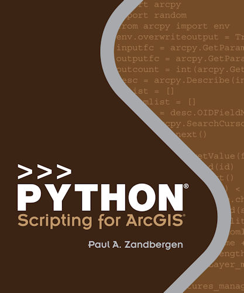

# Python Scripting for ArcGIS

## Info
* [ESRI](http://esripress.esri.com/display/index.cfm?fuseaction=display&websiteid=276&moduleid=0)
* [Book Resources](http://esripress.esri.com/bookResources/index.cfm?event=catalog.book&id=9)

# Toc Brief
[Chapter 1: Introducing Python](Ch01_Introducing_Python.md)
[Chapter 2: Geoprocessing in ArcGIS](Ch02_Geoprocessing_in_ArcGIS.md)
[Chapter 3: Using the Python window](Ch03_Using_the_Python_window.md)
[Chapter 4: Learning Python language fundamentals](Ch04_Learning_Python_language_fundamentals.md)
[Chapter 5: Geoprocessing using Python](Ch05_Geoprocessing_using_Python.md)
[Chapter 6: Exploring spatial data](Ch06_Exploring_spatial_data.md)
[Chapter 7: Manipulating spatial data](Ch07_Manipulating_spatial_data.md)
[Chapter 8: Working with geometries](Ch08_Working_with_geometries.md)
[Chapter 9: Working with rasters](Ch09_Working_with_rasters.md)
[Chapter 10: Map scripting](Ch10_Map_scripting.md)
[Chapter 11: Debugging and error handling](Ch11_Debugging_and_error_handling.md)
[Chapter 12: Creating Python functions and classes](Ch12_Creating_Python_functions_and_classes.md)
[Chapter 13: Creating custom tools](Ch13_Creating_custom_tools.md)
[Chapter 14: Sharing tools](Ch14_Sharing_tools.md)

# Toc Detail

**Part 1: Learning the fundamentals of Python and geoprocessing**  

**Chapter 1: Introducing Python**  
1.1 Introduction  
1.2 Exploring the features of Python  
1.3 Comparing scripting vs. programming  
1.4 Using scripting in ArcGIS  
1.5 Python history and versions  
1.6 About this book  
1.7 Exploring how Python is used  
1.8 Choosing a Python script editor  
Points to remember  

**Chapter 2: Geoprocessing in ArcGIS**  
2.1 Introduction  
2.2 What is geoprocessing?  
2.3 A note on ArcObjects  
2.4 Using toolboxes and tools  
2.5 Learning types and categories of tools  
2.6 Running tools using tool dialog boxes  
2.7 Specifying environment settings  
2.8 Using batch processing  
2.9 Using models and ModelBuilder  
2.10 Using scripting  
2.11 Running scripts as tools  
2.12 Converting a model to a script  
2.13 Scheduling a Python script to run at prescribed times  
Points to remember  

**Chapter 3: Using the Python window**  
3.1 Introduction  
3.2 Opening the Python window  
3.3 Writing and running code  
3.4 Getting assistance  
3.5 Exploring Python window options  
3.6 Saving your work  
3.7 Loading code into the Python window  
Points to remember  

**Chapter 4: Learning Python language fundamentals**  
4.1 Introduction  
4.2 Locating Python documentation and resources  
4.3 Working with data types and structures  
4.4 Working with numbers  
4.5 Working with variables and naming  
4.6 Writing statements and expressions  
4.7 Using strings  
4.8 Using lists  
4.9 Working with Python objects  
4.10 Using functions  
4.11 Using methods  
4.12 Working with strings  
4.13 Working with lists  
4.14 Working with paths  
4.15 Working with modules  
4.16 Controlling workflw using conditional statements  
4.17 Controlling workflw using loop structures  
4.18 Getting user input  
4.19 Commenting scripts  
4.20 Working with code in the PythonWin editor  
4.21 Following coding guidelines  
Points to remember  

**Part 2: Writing scripts**  

**Chapter 5: Geoprocessing using Python**
5.1 Introduction
5.2 Using the ArcPy site package
5.3 Importing ArcPy
5.4 Working with earlier versions of ArcGIS
5.5 Using tools
5.6 Working with toolboxes
5.7 Using functions
5.8 Using classes
5.9 Using environment settings
5.10 Working with tool messages
5.11 Working with licenses
5.12 Accessing ArcGIS Desktop Help
Points to remember

**Chapter 6: Exploring spatial data**
6.1 Introduction
6.2 Checking for the existence of data
6.3 Describing data
6.4 Listing data
6.5 Using lists in for loops
6.6 Working with lists
6.7 Working with tuples
6.8 Working with dictionaries
Points to remember

**Chapter 7: Manipulating spatial data**
7.1 Introduction
7.2 Using cursors to access data
7.3 Using SQL in Python
7.4 Working with table and fild names
7.5 Parsing table and fild names
7.6 Working with text fies
Points to remember

**Chapter 8: Working with geometries**
8.1 Introduction
8.2 Working with geometry objects
8.3 Reading geometries
8.4 Working with multipart features
8.5 Working with polygons with holes
8.6 Writing geometries
8.7 Using cursors to set the spatial reference
8.8 Using geometry objects to work with geoprocessing tools
Points to remember

**Chapter 9: Working with rasters**
9.1 Introduction
9.2 Listing rasters
9.3 Describing raster properties
9.4 Working with raster objects
9.5 Working with the ArcPy Spatial Analyst module
9.6 Using map algebra operators
9.7 Using the ApplyEnvironment function
9.8 Using classes of the arcpy.sa module
9.9 Using raster functions to work with NumPy arrays
Points to remember

**Part 3: Carrying out specialized tasks**  

**Chapter 10: Map scripting**  
10.1 Introduction  
10.2 Working with the ArcPy mapping module  
10.3 Opening map documents  
10.4 Accessing map document properties and methods  
10.5 Working with data frames  
10.6 Working with layers  
10.7 Fixing broken data sources  
10.8 Working with page layout elements  
10.9 Exporting maps  
10.10 Printing maps  
10.11 Working with PDFs  
10.12 Creating map books  
10.13 Using sample mapping scripts  
Points to remember  

**Chapter 11: Debugging and error handling**  
11.1 Introduction  
11.2 Recognizing syntax errors  
11.3 Recognizing exceptions  
11.4 Using debugging  
11.5 Using debugging tips and tricks  
11.6 Error handling for exceptions  
11.7 Raising exceptions  
11.8 Handling exceptions  
11.9 Handling geoprocessing exceptions  
11.10 Using other error-handling methods  
11.11 Watching for common errors  
Points to remember  

**Chapter 12: Creating Python functions and classes**  
12.1 Introduction  
12.2 Creating functions  
12.3 Calling functions from other scripts  
12.4 Organizing code into modules  
12.5 Using classes  
12.6 Working with packages  
Points to remember  

**Part 4: Creating and using script tools**  

**Chapter 13: Creating custom tools**  
13.1 Introduction  
13.2 Why create your own tools?  
13.3 Steps to creating a tool  
13.4 Editing tool code  
13.5 Exploring tool parameters  
13.6 Setting tool parameters  
13.7 Examining an example script tool  
13.8 Customizing tool behavior  
13.9 Working with messages  
13.10 Handling messages for stand-alone scripts and tools  
13.11 Customizing tool progress information  
13.12 Running a script in process  
Points to remember  

**Chapter 14: Sharing tools**  
14.1 Introduction  
14.2 Choosing a method for distributing tools  
14.3 Handling licensing issues  
14.4 Using a standard folder structure for sharing tools  
14.5 Working with paths  
14.6 Finding data and workspaces  
14.7 Creating a geoprocessing package  
14.8 Embedding scripts and password-protecting tools  
14.9 Documenting tools  
14.10 Example tool: Market analysis  
Points to remember  

Appendix A Data source credits  
Appendix B Data license agreement  
Appendix C Installing the data and software  
Index  
